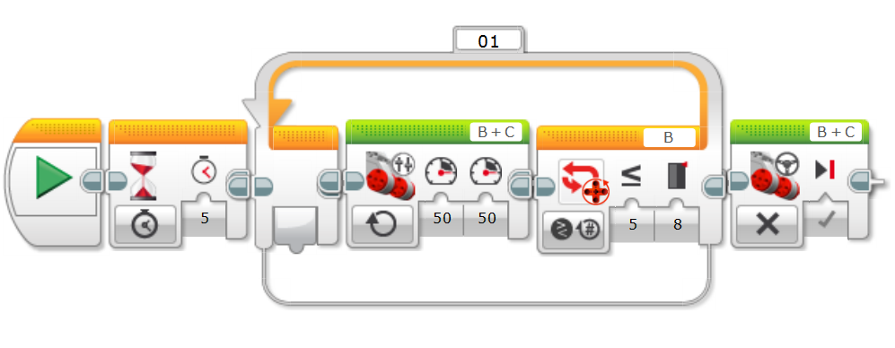
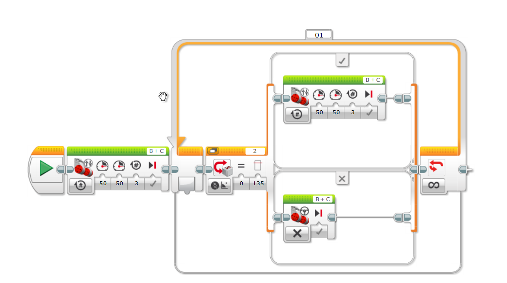
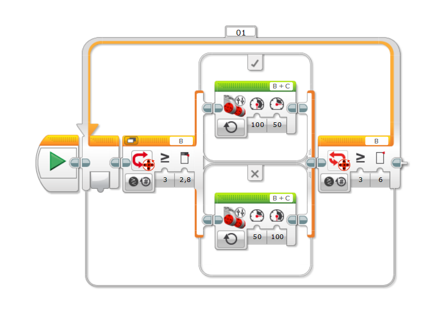
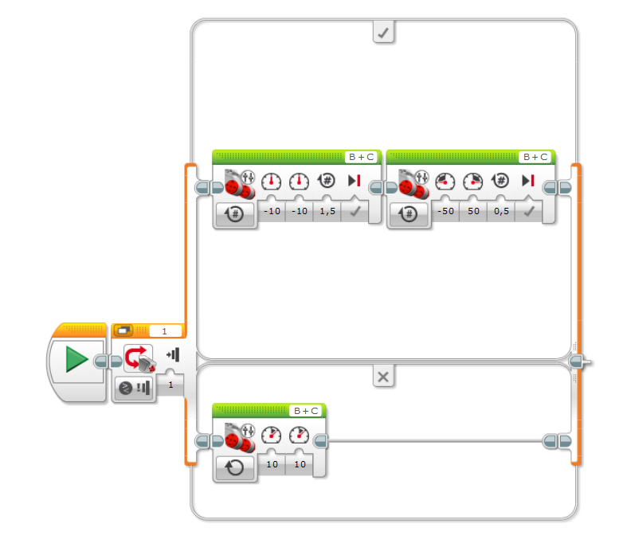

# Robotica_movil_Laboratorio_1

## Integrantes
  -
  - David Felipe Ruiz Reyes
  -
 
## Introducción

En el mundo de la robótica móvil, el uso de vehículos terrestres tiene gran relevancia. Por ello, es vital el reconocimiento de las siguientes características que llegan a tener por ejemplo el Lego EV3 utilizado en este laboratorio, como: el comportamiento del movimiento en llantas, el comportamiento de los sensores junto a sus formas de comunicación y el uso de una lógica de una programación asertiva, correspondiente a la mecánica/electrónica del robot.

## Objetivos

 - Realizar las actividades propuestas utilizando el robot LEGO EV3 y el software LEGO MINDSTORMS Education EV3 para el reconocimiento de los requerimientos de ingeniería en robots móviles desde una vista práctica.
 - Reconocer las características y la lógica que utilizan los sensores, actuadores y comunicaciones del Robot Lego EV3.

## Retos

 - ### Reto 1: 
    - **Objetivo:** Realizar un programa que permita al robot avanzar en linea recta, durante x tiempo, luego avanzar un tiempo diferente y verificar la linealidad de la velocidad.
    - **Solución planteada:**
    Para resolver el reto planteado, se implementa un codigo que realiza un avance por dos segundos, luego se detiene y regresa por dos segundos, despues de esto se repite el proceso con un avance de 4 segundos.
    - **Diagrama de flujo:**
    El flujo del programa se plantea de forma secuencial, en la siguiente imagen:
    
    - **Pista:**
    - **Imagenes:**
    - **Codigo de bloques:**
    
    - **Resultados:**
 - ### Reto 2: 
    - **Objetivo:** Usar el encoder de los motores para contar las revoluciones de las ruedas y avanzar en linea recta hasta completar 8 revoluciones.
    - **Solución planteada:**
    Para resolver el reto planteado, se implementa un codigo que realiza un avance constante dentro de un bucle, el cual evalua el numero de revoluciones de las ruedas y se detiene cuando alcanza o supera las 8 revoluciones * Se añade una pausa al inicio para poder colocar el robot en la posicion deseada y que este pueda avanzar en linea recta *.
    - **Diagrama de flujo:** El diagrama de flujo, es simplemente un ciclo con una condicion de parada.
    
    - **Pista:**
    - **Imagenes:**
    - **Codigo de bloques:**
    
    - **Resultados:**
 - ### Reto 3: 
    - **Objetivo:**
    - **Solución planteada:**
    - **Diagrama de flujo:**
    - **Pista:**
    - **Imagenes:**
    - **Codigo de bloque:**
   

   Para la realización de la S:

    
   
    - **Resultados:**
 - ### Reto 4: 
    - **Objetivo:**
    - **Solución planteada:**
    - **Diagrama de flujo:**
    - **Pista:**
    - **Imagenes:**
    - **Codigo de bloque:**
    - 
   

    - **Resultados:**
 - ### Reto 5: 
    - **Objetivo:**
    - **Solución planteada:**
    - **Diagrama de flujo:**
    - **Pista:**
    - **Imagenes:**
    - **Codigo de bloque:**
      
   
   
    - **Resultados:**

    - **Solución planteada:**
    - **Diagrama de flujo:**
    - **Pista:**
    - **Imagenes:**
    - **Codigo de bloque:**
    - **Resultados:**
