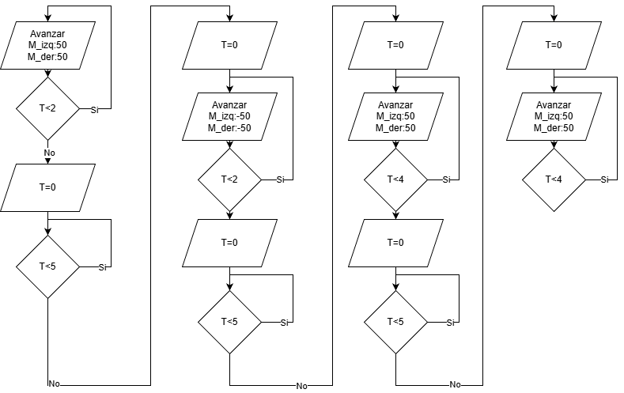
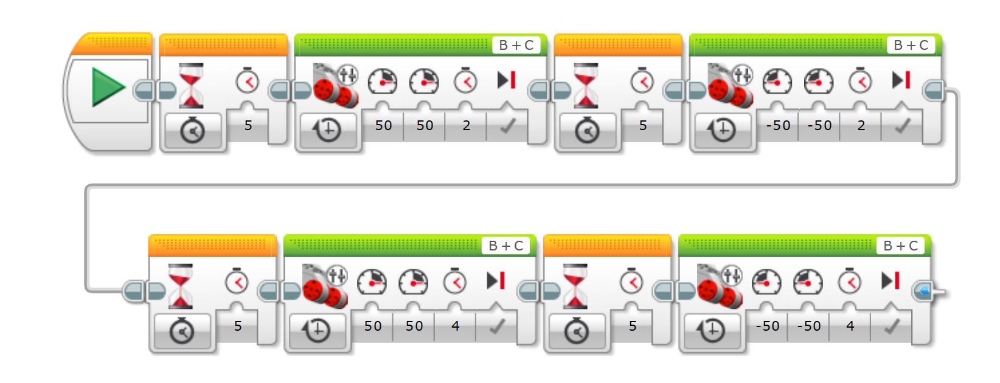
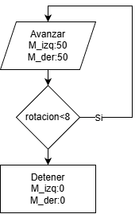
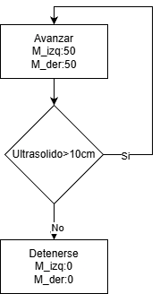
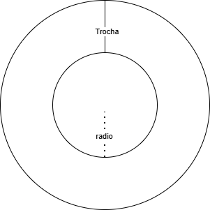

# Robotica_movil_Laboratorio_1

## Integrantes
  - Javier Danilo Tovar Rodriguez
  - David Felipe Ruiz Reyes
  - Diego Andres Fernandez Sosa
 
## Introducción

En el mundo de la robótica móvil, el uso de vehículos terrestres tiene gran relevancia. Por ello, es vital el reconocimiento de las siguientes características que llegan a tener por ejemplo el Lego EV3 utilizado en este laboratorio, como: el comportamiento del movimiento en llantas, el comportamiento de los sensores junto a sus formas de comunicación y el uso de una lógica de una programación asertiva, correspondiente a la mecánica/electrónica del robot.

## Objetivos

 - Realizar las actividades propuestas utilizando el robot LEGO EV3 y el software LEGO MINDSTORMS Education EV3 para el reconocimiento de los requerimientos de ingeniería en robots móviles desde una vista práctica.
 - Reconocer las características y la lógica que utilizan los sensores, actuadores y comunicaciones del Robot Lego EV3.

## Retos

## Actividad 1

 - ### Reto 1: 
    - **Objetivo:** Realizar un programa que permita al robot avanzar en linea recta, durante x tiempo, luego avanzar un tiempo diferente y verificar la linealidad de la velocidad.
    - **Solución planteada:**
    Para resolver el reto planteado, se implementa un codigo que realiza un avance por dos segundos, luego se detiene y regresa por dos segundos, despues de esto se repite el proceso con un avance de 4 segundos.
    - **Diagrama de flujo:**
    El flujo del programa se plantea de forma secuencial, en la siguiente imagen:
    
    - **Codigo de bloques:**
    
    - **Resultados:** Dadas las condiciones del MRU, podemos entender que la distancia recorrida será proporcional al tiempo y ello se observa en la escala de distancia obtenida al escalar el tiempo.
  
      
 - ### Reto 2: 
    - **Objetivo:** Usar el encoder de los motores para contar las revoluciones de las ruedas y avanzar en linea recta hasta completar 8 revoluciones. 
    - **Solución planteada:**
    Para resolver el reto planteado, se implementa un codigo que realiza un avance constante dentro de un bucle, el cual evalua el numero de revoluciones de las ruedas y se detiene cuando alcanza o supera las 8 revoluciones * Se añade una pausa al inicio para poder colocar el robot en la posicion deseada y que este pueda avanzar en linea recta *.
    - **Diagrama de flujo:** El diagrama de flujo, es simplemente un ciclo con una condicion de parada.
      
    
   
    - **Codigo de bloques:**
    
   
    - **Resultados:** 2 * pi * 8rev * 28mm_radio = 1,4 metros de avance. En la realidad se obtuvo un acercamiento importante a este valor teórico, esto gracias a la tecnologia de visualización/conteo de pulsos     magneticos obtenidos desde encoder que permiten conocer las revoluciones dadas.

 - ### Reto 3: 
    - **Objetivo:** Usar el sensor ultrasónico para detener un movimiento de línea recta cuando se detecte un obstáculo a 10cm de distancia.
    - **Solución planteada:** Dentro de un ciclo while se evalua la condicion del sensor de distancia ultrasónico y se ordena la parada cuando se cumpla.
    - **Diagrama de flujo:** El diagrama de flujo, es simplemente un ciclo con una condicion de parada.
   

    - **Codigo de bloques:**
    
    - **Resultados:** El sistema está configurado para detener el vehículo cuando el sensor detecta una distancia menor a 10 cm; sin embargo, la detención no es instantánea debido a la inercia. Cuando el carro se mueve con baja potencia, su velocidad y energía cinética son menores, por lo que al activarse la señal de parada avanza muy poco adicionalmente y se detiene cerca de los 9–10 cm reales. En cambio, a mayor potencia el vehículo alcanza mayor velocidad y, por tanto, mayor inercia; aunque el sensor detecte los 10 cm y envíe la orden de detenerse, el carro continúa avanzando unos centímetros más antes de frenar por completo, terminando más cerca del obstáculo (aproximadamente 6,5–7 cm).

  
## Actividad 2:
  - ### Reto 1:
    - **Objetivo:** Mover las ruedas a distintas velocidades en ambas direcciones. La diferencia se dará en que una rueda se moverá en las siguientes proporciones con respecto a la otra: 1/2, 1/3 y 1/4. 
    - **Solución planteada:** La distancia que debe recorrer cada rueda en un tiempo dado depende de la velocidad que esta lleva, por lo que la relación que existe entre el radio que posee la rueda interna y la externa son linealmente dependientes:

     
   
   Al calcular el radio sobre el cual debe girar larueda interna se encuentra la siguiente relación:
   r=T/(n-1)

   Si las ruedas giran a la misma velocidad, el radio de giro es infinito, el vehiculo avanza en linea recta

   - Para el caso de una velocidad del externo de 2 veces el interno el radio de giro es de 1 trocha.
   - Para el caso de una velocidad del externo de 3 veces el interno el radio de giro es de media trocha.
   - Para el caso de una velocidad del externo de 4 veces el interno el radio de giro es de un cuarto de trocha.

   Se condiciona la velocidad de las ruedas independientemente, se ejecuta el programa y se mide el radio de giro correspondiente.
    - **Diagrama de flujo:**
   
    - **Codigo de bloque:**
     
  
  - **Resultados:** Como se observa en las imagenes y videos del comportamiento del robot móvil en este reto, la trocha (distancia entre chantas de dirección) será la constante que determina el reccorido rotacional. Teniendo en cuenta que el ancho de la rueda es de 3cm y la trocha de _____. Se obtuvieron los siguientes resultados respectivamente (Potencia=P): Para 1/2P [22 a 21]cm, para 1/3P [6,5 a 7]cm y 1/4P [3,5 a 4]cm
    
  - ### Reto 2:
    - **Objetivo:** Crear una trayectoria en forma de S
    - **Solución planteada:** Se realiza un bucle y una interrupción, en donde para las "i primeras revoluciones" se tenga un motor con menos potencia generando el giro y despues al superar esas i revoluciones
    se inviertan las potencias de los motores, generando el giro inverso. El bucle acaba despues de n revoluciones.
    - **Diagrama de flujo:**
   
    

    - **Codigo de bloque:**
      
  
  - **Resultados:** Se lograron distintas S, dadas por la relación velocidad/potencia y la proporción con la trocha manejada.

## Actividad 3:
  - ### Reto:
    - **Objetivo:** Usar el girosensor para generar un movimiento en línea recta que en cierto momento cambie su dirección en 45 y 135 grados. 
    - **Solución planteada:** Se programa el robot para que avance tres revoluciones inicialmente, luego dentro de un bucle se da giro y se evalua si este es mayor o igual al valor indicado (45 y 135), si se cumple la condicion permite de nuevo realizar un avance recto como al principio.
    - **Diagrama de flujo:**
   
    

    - **Codigo de bloque:**
   
   
  - **Resultados:** Al igual que el ultrasonido, el sensor puede tener tanto incertidumbre en su repetibilidad como en su exactitud. Aún así, el comportamiento de modificar fuertemente la dirección del robot fue fácilmente dado. Se obtuvieron los siguientes ángulos finales, para el caso de 45° a media potencia: 52°. Y para el caso de 135° a baja potencia: 135°. (Vuelve el tema de inercia y control de frenado/amortiguación)

## Actividad 4:
 - ### Reto: 
    - **Objetivo:** Usar el sensor infrarrojo para realizar la siguiente lógica: Avance indeterminado en línea recta donde al detectar un obstáculo a Xcm de distancia se devuelva 10cm, gire 45° y siga su camino.
    - **Solución planteada:** Se programa un bucle para evaluar el estado del receptor infrarrojo mientras el robot avanza en linea recta, cuando se cumple la condicion de distancia se da reversa al robot y se le da giro. Al terminar se le da un avance final en linea recta.               
    - **Diagrama de flujo:**
      
   

    - **Codigo de bloque:**
    - 
   

    - **Resultados:** Aquí también se observo la necesidad de un control sobre las inercias y el ampliar la lógica a comportamientos más complejos que el MRU. Esto debido a que elementos como frecuencia o delay en la comunicación pueden llevar a que el robot choque incluso cuando el sensor realizo correctamente su trabajo. Ahora también, los sensores tienen una forma "individual" de entregar la información y por ello es importante contrastar que se tiene en la realidad y que es lo medido (calibrar). En el caso de este sensor se tenía lo siguiente: 7cm era 10unidades en el sensor y 10cm era 22unidades en el sensor. Con estos valores pueden entrar preguntas como: ¿Cuál es la zona lineal del sensor?, ¿Cuál es el rango del sensor?

## Actividad 5:
 - ### Reto: 
    - **Objetivo:** Usar el sensor de contacto para realizar la siguiente lógica: Avance indeterminado en línea recta donde al detectar un obstáculo a Xcm de distancia se devuelva 10cm (distancia dada por otro sensor), gire 45° y siga su camino.
    - **Solución planteada:** Se programa un bucle para que el robot avance mientras se evalua la condicion del sensor de contacto. Cuando se cumple dicha condicion, se da reversa al robot y se le da giro de 90°. Al terminar se regresa al inicio del programa y vuelve a comenzar.
    - **Diagrama de flujo:**

     

    - **Codigo de bloque:**
      
   
   
    - **Resultados:** El sensor de contacto llega como una solución simple y rápida justamente para sistemas robótizados que no poseen una visión de máquina más compleja o necesitan un mejor control en el movimiento.
 

